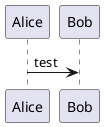

## Elemente und Relationen in ADF
### Software@Runtime
#### Die folgende Tabelle zeigt die Elemente, die in Ansichten vom Typ Daten@Devtime und Funktionen@Devtime verwendet werden können.

| Element     | Description | Code |
| ----------- | ----------- |----- |
| Header      | Title       |
| Paragraph   | Text        |

### Software@Devtime
#### Die folgende Tabelle zeigt die Elemente, die in Ansichten vom Typ Data@Devtime und Functions@Devtime verwendet werden können.

| Element     | Description | Code |
| ----------- | ----------- |----- |
| Header      | Title       |
| Paragraph   | Text        |

### Environment@Runtime
#### Die folgende Tabelle zeigt die Elemente, die in Ansichten vom Typ Deployment@Runtime und Activities@Runtime verwendet werden können.

| Element     | Description | Code |
| ----------- | ----------- |----- |
| Header      | Title       |
| Paragraph   | Text        |

### Environment@Devtime
#### Die folgende Tabelle zeigt die Elemente, die in Ansichten vom Typ Deployment@Devtime und Activities@Devtime verwendet werden können.

| Element     | Description | Code |
| ----------- | ----------- |----- |
| Header      | Title       |
| Paragraph   | Text        |