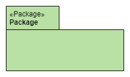
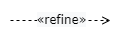
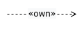

## Elemente und Relationen in ADF
### Software@Runtime
#### Die folgende Tabelle zeigt die Elemente, die in Ansichten vom Typ Daten@Devtime und Funktionen@Devtime verwendet werden können.

| Element     | Code        | Anmerkung    |
| ----------- | ----------- | ------------ |
|      | 1. ```:<<Role>>\nRole: #fff2cc``` <br>2. ```:Role: #fff2cc``` | 1. '\n' dient dazu, dass es so wie im Bild aussieht. Ansonsten kann man auch '<\<Role>>\n' weglassen.<br> 2. 'Role' wird ohne '<\<Role>>' abgebildet.|
|   | ```node "System Name" << System >> as w #fff2cc```| - |
|   | ```node "External System Name" << External system >> as w #fff2cc```| - |
|   | ```folder "<<Layer>> \nLayer" as l #ffe6cc {}``` | In '{}' können Komponente hinzugefügt werden. |
|   | ```folder "<<Cluster>> \nCluster" as c #ffe6cc {} ```        | In '{}' können Komponente hinzugefügt werden. |
|   | ```[===Component] <<Component>> as c1```   | '===' wird verwendet für Bold. |
|   | 1. ```-0)-```<br> 2. ```-(0-``` | - |
|   | ```rectangle "**Interface**" <<Interface>> as t ##ffe6cc``` | '**' wird verwendet für Bold.  |
|   | ```Element1 <-[thickness=10]-> Element2: Connector``` | - |
|   | ```rectangle "**Data**" <<Data>> as a #fff2cc{label "date \ndata1 \ndata2" }```| '**' wird verwendet für Bold. |
|   | ```rectangle "**Technology**" <<Technology>> as t #f8cecc``` | '**' wird verwendet für Bold. |
|   | ```Element1 --> Element2  #black;line.dashed;:<<dataflow>>```        |Nach '<\<dataflow>>' kann die Beschreibung noch hinzugefügt werden.|
|   | ```Element1 --> Element2  #black;line.dashed;:<<use>>``` | Nach '<\<use>>' kann die Beschreibung noch hinzugefügt werden.  |
|   |  ```rectangle "System Scope" as SystemScope #line.dashed{ node "Node Name" << System >> }```|Wenn man System Scope verwendet, kann der Pfeil die System-Komponent im System Scope erreicht werden.|
|   | ```note "This note is a note." as n #ffffff```| - |
|   | ```-```      | "-" kann verlängert werden(z.B. --). Die Linie sieht auch länger aus.|
### Software@Devtime
#### Die folgende Tabelle zeigt die Elemente, die in Ansichten vom Typ Data@Devtime und Functions@Devtime verwendet werden können.

| Element     | Code        | Anmerkung   |
| ----------- | ----------- | ----------- |
|   |  ```rectangle "**Module**" <<Module>> as m #b9e0a5``` |'**' wird verwendet für Bold. |
|   | ```rectangle "**Interface**" <<Interface>> as t #b9e0a5``` | '**' wird verwendet für Bold.  |
|   | ```package "<<Package>> \nPackage" as p #b9e0a5{ label "\n" as la1 }```  | - |
|   | ```object Controller { ``` <br> ```&#43; Controller()``` <br> ```__ ``` <br> ```&#43; getData(parameters: DataRequest) : data``` <br> ```&#43; getInstance() : Object } ``` | '&\#43;' sthet für '+'. <br> '&\#8722;' steht für '-'. <br> Mit '__' kann eine neue Linie erstellt werden.
|   | ```rectangle "**Library**" <<Library>> as m #b9e0a5``` |'**' wird verwendet für Bold. |
|   | ```rectangle "**Technology**" <<Technology>> as t #f8cecc``` | '**' wird verwendet für Bold. |
|   | ```Element1 --> Element2  #black;line.dashed;:<<refine>>```| Nach '<\<refine>>' kann die Beschreibung noch hinzugefügt werden.  |
|   | ```Element1 --> Element2  #black;line.dashed;:<<use>>```| Nach '<\<use>>' kann die Beschreibung noch hinzugefügt werden.  |
|   | Asscociation : ```-``` <br> Generalization: ```-\|>```<br> Realization: ```..\|>```<br> Composition: ```*--``` <br> Aggregation: ```o--```| - |
|   | ```note "This note is a note." as n #ffffff```| - |
|   | ```-``` | "-" kann verlängert werden(z.B. --). Die Linie sieht auch länger aus. |

### Environment@Runtime
#### Die folgende Tabelle zeigt die Elemente, die in Ansichten vom Typ Deployment@Runtime und Activities@Runtime verwendet werden können.

| Element     | Code        | Anmerkung   |
| ----------- | ----------- | ----------- |
|   | ```node "**Mobile Device**" <<Computing Node>> as a #ffe6cc{}```| '**' wird verwendet für Bold. |
|   | ```node "**App-Sandbox**" <<Execution Environment>> as e ##ffe6cc{ }``` |'**' wird verwendet für Bold.|
|   | ```artifact "**Mobile App**" <<Deployment Artifact>> as a #b9e0a5```| '**' wird verwendet für Bold. |
|   |```action "**Operation Process**" <<Operation Process>> as op #ffe6cc``` |'**' wird verwendet für Bold. |
|   |  ```rectangle "**Technology**" <<Technology>> as t #f8cecc``` | '**' wird verwendet für Bold. |
|   | ```rectangle "**Thread**" <<Thread>> as t #ffe6cc``` | '**' wird verwendet für Bold.  |
|      | 1. ```:<<Role>>\nRole:``` <br>2. ```:Role: #fff2cc``` | 1. '\n' dient dazu, dass es so wie im Bild aussieht. Ansonsten kann man auch '<\<Role>>\n' weglassen.<br> 2. 'Role' wird ohne '<\<Role>>' abgebildet.|
|   | ```node "**Web Abteilung**" <<Organizational Unit>> as a #ffe6cc{}```| '**' wird verwendet für Bold. |
|   | ```Element1 --> Element2  #black;line.dashed;:<<operate>>```| Nach '<\<operate>>' kann die Beschreibung noch hinzugefügt werden.  | 
|   | ```Element1 --> Element2  #black;line.dashed;:<<execute>>```| Nach '<\<execute>>' kann die Beschreibung noch hinzugefügt werden.  | 
|   | ```Element1 --> Element2  #black;line.dashed;:<<deploy>>```| Nach '<\<deploy>>' kann die Beschreibung noch hinzugefügt werden.  | 
|   | ```Element1 --> Element2  #black;line.dashed;:<<own>>```| Nach '<\<own>>' kann die Beschreibung noch hinzugefügt werden.  | 
|   | ```Element1 --> Element2  #black;line.dashed;:<<manifest>>```| Nach '<\<manifest>>' kann die Beschreibung noch hinzugefügt werden.  |
|   | ```->``` | "->" kann verlängert werden(z.B. -->). Die Linie sieht auch länger aus. |
|   | ```note "This note is a note." as n #ffffff```| - |
|   | ```-```      | "-" kann verlängert werden(z.B. --). Die Linie sieht auch länger aus. |

### Environment@Devtime
#### Die folgende Tabelle zeigt die Elemente, die in Ansichten vom Typ Deployment@Devtime und Activities@Devtime verwendet werden können.

| Element     | Code        | Anmerkung   |
| ----------- | ----------- | ----------- |
|      | 1. ```:<<Role>>\nRole:``` <br>2. ```:Role: #fff2cc``` | 1. '\n' dient dazu, dass es so wie im Bild aussieht. Ansonsten kann man auch '<\<Role>>\n' weglassen.<br> 2. 'Role' wird ohne '<\<Role>>' abgebildet.|
|   |```node "**Web Abteilung**" <<Organizational Unit>> as o #ffe6cc{}```| '**' wird verwendet für Bold. |
|   | ```rectangle "**Project Increment**" <<Project Increment>> as p #b9e0a5``` | '**' wird verwendet für Bold. |
|   | ```artifact "**Mobile App**" <<Deployment Artifact>> as a #b9e0a5```| '**' wird verwendet für Bold. |
|   | ```action "**Operation Process**" <<Operation Process>> as op #b9e0a5``` |'**' wird verwendet für Bold. |
|   |```node "**GitLab**" <<Deployment Tool>> as a #b9e0a5{}```| '**' wird verwendet für Bold. |
|   | ```rectangle "**Technology**" <<Technology>> as t #f8cecc``` | '**' wird verwendet für Bold. |
|   | ```Element1 --> Element2  #black;line.dashed;:<<manifest>>```| Nach '<\<manifest>>' kann die Beschreibung noch hinzugefügt werden.  |
|   | ```Element1 --> Element2  #black;line.dashed;:<<use>>```| Nach '<\<use>>' kann die Beschreibung noch hinzugefügt werden.  |
|   | ```Element1 --> Element2  #black;line.dashed;:<<own>>```| Nach '<\<own>>' kann die Beschreibung noch hinzugefügt werden.  | 
|   | ```note "This note is a note." as n #ffffff```| - |
|   | ```-```      | "-" kann verlängert werden(z.B. --). Die Linie sieht auch länger aus. |