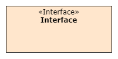

## Elemente und Relationen in ADF
### Software@Runtime
#### Die folgende Tabelle zeigt die Elemente, die in Ansichten vom Typ Daten@Devtime und Funktionen@Devtime verwendet werden können.

| Element     | Code        | Anmerkung    |
| ----------- | ----------- | ------------ |
|      | 1. ```: <<Role>>\nRole:``` <br>2. ```:Role: #fff2cc``` | 1. '\n' dient dazu, dass es so wie im Bild aussieht. Ansonsten kann man auch '<\<Role>>\n' weglassen.<br> 2. 'Role' wird ohne '<\<Role>>' abgebildet.|
|   | ```node "System Name" << System >> as w #fff2cc```| - |
|   | ```node "External System Name" << External system >> as w #fff2cc```| - |
|   | Text        | txt |
|   | Text        | txt |
|   | Text        | txt |
|   | ```-0)-``` | - |
|   | Text        | txt |
|   | ```Element1 <-[thickness=10]-> Element2: Connector``` | - |
|   | ```rectangle "Data" <<Data>> as a #fff2cc{label "date \nmeal \nprice \ncoldBowlProbability" }```| - |
|   | Text        | txt |
|   | ```Element1 --> Element2  #black;line.dashed;:<<dataflow>>```        |Nach '<\<dataflow>>' kann die Beschreibung noch hinzugefügt werden.|
|   | ```Element1 --> Element2  #black;line.dashed;:<<use>>``` | Nach '<\<use>>' kann die Beschreibung noch hinzugefügt werden.  |
|   |  ```rectangle "System Scope" as SystemScope #line.dashed{ node "Node Name" << System >> }```|Wenn man System Scope verwendet, kann der Pfeil die System-Komponent im System Scope nicht erreicht werden.|
|   | ```note "This note is a note." as n #ffffff```| - |
|   | ```-```      | "-" kann verlängert werden(z.B. --), sieht die Linie auch länger aus. |
### Software@Devtime
#### Die folgende Tabelle zeigt die Elemente, die in Ansichten vom Typ Data@Devtime und Functions@Devtime verwendet werden können.

| Element     | Code        | Anmerkung   |
| ----------- | ----------- | ----------- |
|   | Text        |
|   | Text        |
|   | Text        |
|   | Text        |
|   | Text        |
|   | Text        |
|   | Text        |
|   | ```Element1 --> Element2  #black;line.dashed;:<<use>>```| Nach '<\<use>>' kann die Beschreibung noch hinzugefügt werden.  |
|   | Text        | txt|
|   | ```note "This note is a note." as n #ffffff```| - |
|   | ```-```      | "-" kann verlängert werden(z.B. --), sieht die Linie auch länger aus. |

### Environment@Runtime
#### Die folgende Tabelle zeigt die Elemente, die in Ansichten vom Typ Deployment@Runtime und Activities@Runtime verwendet werden können.

| Element     | Code        | Anmerkung   |
| ----------- | ----------- | ----------- |
|   | Text        |
|   | Text        |
|   | Text        |
|   | Text        |
|   | Text        |
|   | Text        |
|      | 1. ```: <<Role>>\nRole:``` <br>2. ```:Role: #fff2cc``` | 1. '\n' dient dazu, dass es so wie im Bild aussieht. Ansonsten kann man auch '<\<Role>>\n' weglassen.<br> 2. 'Role' wird ohne '<\<Role>>' abgebildet.|
|   | Text        |
|   | ```Element1 --> Element2  #black;line.dashed;:<<operate>>```| Nach '<\<operate>>' kann die Beschreibung noch hinzugefügt werden.  | 
|   | ```Element1 --> Element2  #black;line.dashed;:<<execute>>```| Nach '<\<execute>>' kann die Beschreibung noch hinzugefügt werden.  | 
|   | ```Element1 --> Element2  #black;line.dashed;:<<deploy>>```| Nach '<\<deploy>>' kann die Beschreibung noch hinzugefügt werden.  | 
|   | ```Element1 --> Element2  #black;line.dashed;:<<own>>```| Nach '<\<own>>' kann die Beschreibung noch hinzugefügt werden.  | 
|   | ```Element1 --> Element2  #black;line.dashed;:<<manifest>>```| Nach '<\<manifest>>' kann die Beschreibung noch hinzugefügt werden.  |
|   | ```->``` | "->" kann verlängert werden(z.B. -->), sieht die Linie auch länger aus. |
|   | ```note "This note is a note." as n #ffffff```| - |
|   | ```-```      | "-" kann verlängert werden(z.B. --), sieht die Linie auch länger aus. |

### Environment@Devtime
#### Die folgende Tabelle zeigt die Elemente, die in Ansichten vom Typ Deployment@Devtime und Activities@Devtime verwendet werden können.

| Element     | Code        | Anmerkung   |
| ----------- | ----------- | ----------- |
|      | 1. ```: <<Role>>\nRole:``` <br>2. ```:Role: #fff2cc``` | 1. '\n' dient dazu, dass es so wie im Bild aussieht. Ansonsten kann man auch '<\<Role>>\n' weglassen.<br> 2. 'Role' wird ohne '<\<Role>>' abgebildet.|
|   | Text        |
|   | Text        |
|   | Text        |
|   | Text        |
|   | Text        |
|   | Text        |
|   | ```Element1 --> Element2  #black;line.dashed;:<<manifest>>```| Nach '<\<manifest>>' kann die Beschreibung noch hinzugefügt werden.  |
|   | ```Element1 --> Element2  #black;line.dashed;:<<use>>```| Nach '<\<use>>' kann die Beschreibung noch hinzugefügt werden.  |
|   | ```Element1 --> Element2  #black;line.dashed;:<<own>>```| Nach '<\<own>>' kann die Beschreibung noch hinzugefügt werden.  | 
|   | ```note "This note is a note." as n #ffffff```| - |
|   | ```-```      | "-" kann verlängert werden(z.B. --), sieht die Linie auch länger aus. |