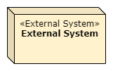
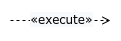
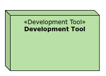

## Elemente und Relationen in ADF
Auf dieser Seite https://github.com/architecture-decomposition-framework/welcome-to-adf/blob/main/adf-elements/ADF-elements.md finden Sie eine Liste aller Elemente und Relationen in ADF.
Zusätzlich gibt es eine Beschreibung für jedes Element.
Diese Datei zeigt alle Elemente in PlantUML mit einem Beispielcode.

Diese Liste dient der schnellen Übersicht über alle Elemente. Deshalb ist der Farbcode noch nicht global definiert. Wenn Sie schnell etwas erstellen wollen, können Sie den Code kopieren. Wenn man die Elemente mit Farben global definieren will, dann findet man den Ordner Color-Element, in dem alle Elemente mit Farbe global mit skinparam definiert wurden.


Alternativ kann der Code '!include color.plantuml' an den Anfang der Datei geschrieben werden, um den Zugriff auf den Farbcode zu ermöglichen. Ersetzen Sie z.B. #fff2cc durch Yellow.
### Software@Runtime
#### Die folgende Tabelle zeigt die Elemente, die in Ansichten vom Typ Daten@Devtime und Funktionen@Devtime verwendet werden können.

| Element     | Code        | Anmerkung    |
| ----------- | ----------- | ------------ |
|      | 1. ```:<<Role>>\n**Role**: as r #fff2cc``` <br>2. ```:Role: as r #fff2cc``` | 1. '\n' dient dazu, dass es so wie im Bild aussieht. Ansonsten kann man auch '<\<Role>>\n' weglassen.<br> 2. 'Role' wird ohne '<\<Role>>' abgebildet. 3. '**' wird verwendet für Bold.|
|   | ```node "**System**" <<System>> as s #fff2cc```|'**' wird verwendet für Bold.|
|   | ```node "**External System**" <<External System>> as es #fff2cc```|'**' wird verwendet für Bold.|
|   | ```folder "<<Layer>> \n**Layer**" as f #ffe6cc {}``` | 1. Um die Überschrift des Elements richtig zu platzieren, muss ein Element in '{}' geschrieben werden. 2. Alternativ kann man 'label "\n"'hinzufügen. Es sieht besser aus, wenn sich kein Element innerhalb des Layers befindet. |
|   | ```folder "<<Cluster>> \n**Cluster**" as c #ffe6cc {} ```  | 1. Um die Überschrift des Elements richtig zu platzieren, muss ein Element in '{}' geschrieben werden.<br> 2. Alternativ kann man 'label "\n"'hinzufügen. Es sieht besser aus, wenn sich kein Element innerhalb des Clusters befindet. |
|   | ```Component "**Component**" <<Component>> as c fff2cc```   | '**' wird verwendet für Bold. |
|   | 1. ```-0)-```<br> 2. ```-(0-``` | Für Pfeilbeschriftung: '-0)- :use' |
|   | ```rectangle "**Interface**" <<Interface>> as t ##ffe6cc``` | '**' wird verwendet für Bold.  |
|   | ```Element1 <-[thickness=10]-> Element2: Connector``` | - |
|   | ```rectangle "**Data**" <<Data>> as a #fff2cc{label "date \ndata1 \ndata2" }```| '**' wird verwendet für Bold. |
|   | ```rectangle "**Technology**" <<Technology>> as t #f8cecc``` | '**' wird verwendet für Bold. |
|   | ```Element1 ..> Element2  :<<dataflow>>```        |Für Pfeilbeschriftung: ':<\<dataflow>> dataflow'|
|   | ```Element1 ..> Element2  :<<use>>``` | Für Pfeilbeschriftung: ':<\<use>> use' |
|   |  ```rectangle "System Scope" as SystemScope #line.dashed{ node "System Name" <<System>> }```|Wenn man System Scope verwendet, kann der Pfeil die System-Komponent im System Scope erreicht werden.|
|   | ```note "This note is a note." as n #ffffff```| - |
|   | ```-```      | "-" kann verlängert werden(z.B. --). Die Linie sieht auch länger aus.|
### Software@Devtime
#### Die folgende Tabelle zeigt die Elemente, die in Ansichten vom Typ Data@Devtime und Functions@Devtime verwendet werden können.

| Element     | Code        | Anmerkung   |
| ----------- | ----------- | ----------- |
|   |  ```rectangle "**Module**" <<Module>> as m #b9e0a5``` |'**' wird verwendet für Bold. |
|   | ```rectangle "**Interface**" <<Interface>> as i #b9e0a5``` | '**' wird verwendet für Bold.  |
|   | ```package "<<Package>> \n**Package**" #b9e0a5{ 'Elemente hinzufügen }```  |1. Wenn 'as xxx' geschrieben wird, muss unbedingt ein Element in {} eingefügt werden, da sonst die Überschrift nicht mehr korrekt positioniert ist.<br> 2. Alternativ kann man 'label "\n"'hinzufügen. Es sieht besser aus, wenn sich kein Element innerhalb des Packages befindet.|
|   | ```object Datatype <<Datatype>>{ ``` <br> ```&#43; field: Type``` <br> ```__ ``` <br> ```&#43; constructor(): Type``` <br> ```__ ``` <br> ```&#43; method():Type } ``` | '&\#43;' sthet für '+'. <br> '&\#8722;' steht für '-'. <br> Mit '__' kann eine neue Linie erstellt werden.
|   | ```rectangle "**Library**" <<Library>> as l #b9e0a5``` |'**' wird verwendet für Bold. |
|   | ```rectangle "**Technology**" <<Technology>> as t #f8cecc``` | '**' wird verwendet für Bold. |
|   | ```Element1 .> Element2  :<<refine>>```| Für Pfeilbeschriftung: ':<\<refine>> refine'  |
|   | ```Element1 .> Element2  :<<use>>```| Für Pfeilbeschriftung: ':<\<use>> use'  |
|   | Asscociation : ```-``` <br> Generalization: ```-\|>```<br> Realization: ```..\|>```<br> Composition: ```*--``` <br> Aggregation: ```o--```| - |
|   | ```note "This note is a note." as n #ffffff```| - |
|   | ```-``` | "-" kann verlängert werden(z.B. --). Die Linie sieht auch länger aus. |

### Environment@Runtime
#### Die folgende Tabelle zeigt die Elemente, die in Ansichten vom Typ Deployment@Runtime und Activities@Runtime verwendet werden können.

| Element     | Code        | Anmerkung   |
| ----------- | ----------- | ----------- |
|   | ```node "**Computing Node**" <<Computing Node>> as cn #ffe6cc{}```| '**' wird verwendet für Bold. |
|   | ```node "**Execution Environment**" <<Execution Environment>> as ee ##ffe6cc{ }``` |'**' wird verwendet für Bold.|
|   | ```artifact "**Deployment Artifact**" <<Deployment Artifact>> as da #b9e0a5```| '**' wird verwendet für Bold. |
|   |```action "**Operation Process**" <<Operation Process>> as op #ffe6cc``` |'**' wird verwendet für Bold. |
|   |  ```rectangle "**Technology**" <<Technology>> as t #f8cecc``` | '**' wird verwendet für Bold. |
|   | ```rectangle "**Thread**" <<Thread>> as t #ffe6cc``` | '**' wird verwendet für Bold.  |
|      | 1. ```:<<Role>>\n**Role**: as r #fff2cc``` <br>2. ```:Role: as r #fff2cc``` | 1. '\n' dient dazu, dass es so wie im Bild aussieht. Ansonsten kann man auch '<\<Role>>\n' weglassen.<br> 2. 'Role' wird ohne '<\<Role>>' abgebildet. 3. '**' wird verwendet für Bold.|
|   | ```node "**Organizational Unit**" <<Organizational Unit>> as a #ffe6cc{}```| '**' wird verwendet für Bold. |
|   | ```Element1 .> Element2  :<<operate>>```| Für Pfeilbeschriftung: ':<\<operate>> operate'  | 
|   | ```Element1 .> Element2  :<<execute>>```| Für Pfeilbeschriftung: ':<\<execute>> execute'  | 
|   | ```Element1 .> Element2  :<<deploy>>```| Für Pfeilbeschriftung: ':<\<deploy>> deploy'  | 
|   | ```Element1 .> Element2  :<<own>>```| Für Pfeilbeschriftung: ':<\<own>> own'  | 
|   | ```Element1 .> Element2  :<<manifest>>```| Für Pfeilbeschriftung: ':<\<manifest>> manifest'  |
|   | ```->``` | "->" kann verlängert werden(z.B. -->). Die Linie sieht auch länger aus. |
|   | ```note "This note is a note." as n #ffffff```| - |
|   | ```-```      | "-" kann verlängert werden(z.B. --). Die Linie sieht auch länger aus. |

### Environment@Devtime
#### Die folgende Tabelle zeigt die Elemente, die in Ansichten vom Typ Deployment@Devtime und Activities@Devtime verwendet werden können.

| Element     | Code        | Anmerkung   |
| ----------- | ----------- | ----------- |
|      | 1. ```:<<Role>>\n**Role**: as r #fff2cc``` <br>2. ```:Role: as r #fff2cc``` | 1. '\n' dient dazu, dass es so wie im Bild aussieht. Ansonsten kann man auch '<\<Role>>\n' weglassen.<br> 2. 'Role' wird ohne '<\<Role>>' abgebildet. 3. '**' wird verwendet für Bold.|
|   |```node "**Organizational Unit**" <<Organizational Unit>> as ou #ffe6cc{}```| '**' wird verwendet für Bold. |
|   | ```rectangle "**Project Increment**" <<Project Increment>> as pi #b9e0a5``` | '**' wird verwendet für Bold. |
|   | ```artifact "**Deployment Artifact**" <<Deployment Artifact>> as da #b9e0a5```| '**' wird verwendet für Bold. |
|   | ```action "**Deployment Process**" <<Deployment Process>> as dp #b9e0a5``` |'**' wird verwendet für Bold. |
|   |```node "**Deployment Tool**" <<Deployment Tool>> as dt #b9e0a5{}```| '**' wird verwendet für Bold. |
|   | ```rectangle "**Technology**" <<Technology>> as t #f8cecc``` | '**' wird verwendet für Bold. |
|   | ```Element1 .> Element2  :<<manifest>>```| Für Pfeilbeschriftung: ':<\<manifest>> manifest'  |
|   | ```Element1 .> Element2  :<<use>>```| Für Pfeilbeschriftung: ':<\<use>> use'  |
|   | ```Element1 .> Element2  :<<own>>```| Für Pfeilbeschriftung: ':<\<own>> own'  | 
|   | ```note "This note is a note." as n #ffffff```| - |
|   | ```-```      | "-" kann verlängert werden(z.B. --). Die Linie sieht auch länger aus. |