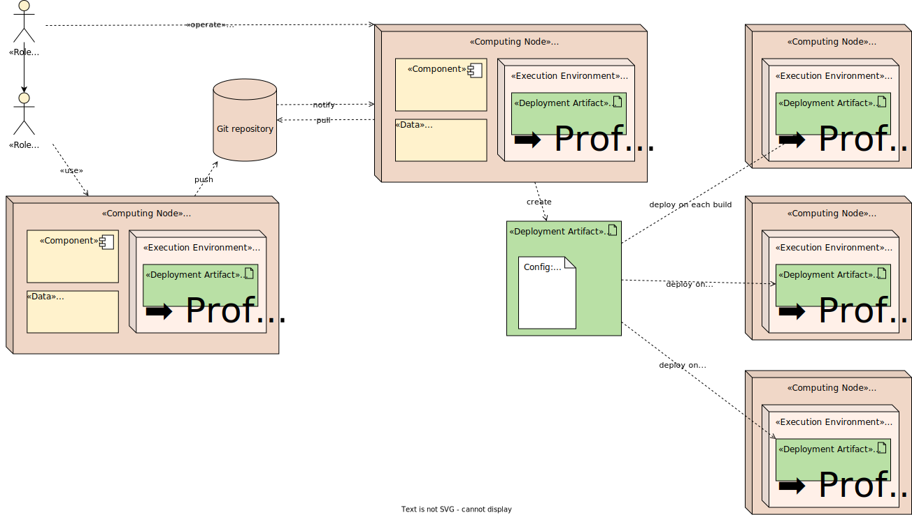
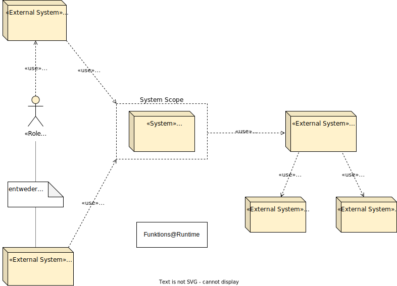
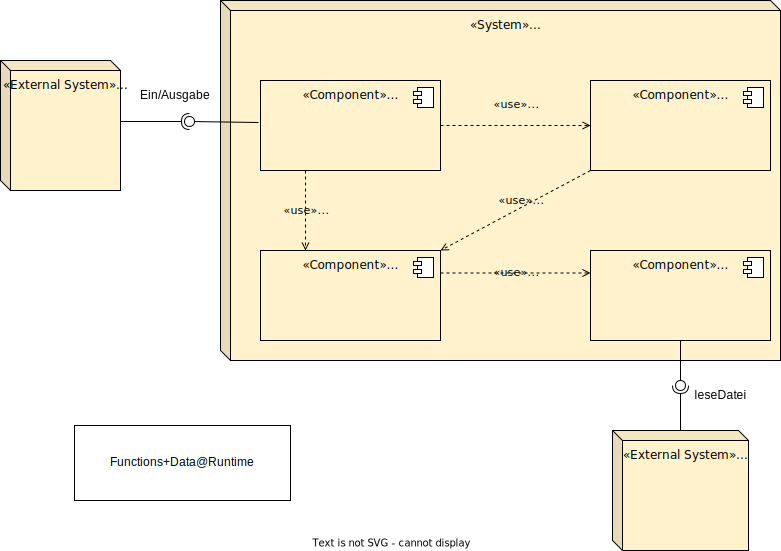
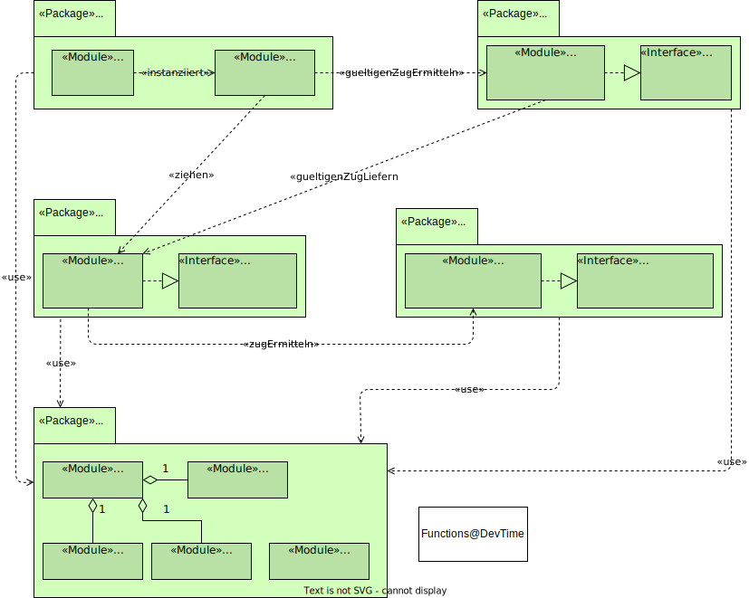

## Vergleich mit diagram.net und plantuml im Beispiel DD und DocChess
|
Nr.| Diagram.net     | Plantuml        | 
| ----------- | ----------- | ----------- | 
|1|||
|2|||
|3|||
|4|||

### Anmerkung:
Selbst bei komplizierten Diagrammen können sie gut dargestellt werden, wenn ihre Position bestimmt ist. Allerdings ist die Positionierung der Komponenten nicht immer erfolgreich. Im Bild 1 kann die Position der beiden Komponenten nicht wie in Diagramm.net abgebildet werden. Im Bild 3 sind die Positionen der vier Komponenten im System DocChess nicht im Blocksatz. Außerdem kann es ein Problem sein, wenn die Beschreibung des Pfeils zu lang ist oder sich an einer ungünstigen Position befindet. Wie in Bild 2 zu sehen ist, überlappt der Pfeil die Beschreibung. Ein weiteres Problem entsteht, wenn zu viele Pfeile im Diagramm vorhanden sind, da dieses dann leicht chaotisch wirkt. In diesem Fall ist es umso wichtiger, die Position der Komponente korrekt zu bestimmen.