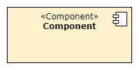
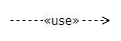
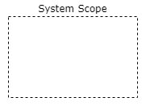
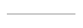

## Experiment für ADF-Methode mit PlantUML und Diagrams

### 1. Anleitung für PlantUML
PlantUML ist ein textbasiertes Werkzeug, das die Erstellung von Diagrammen
mittels einer einfachen, menschlich verständlichen Textbeschreibung ermöglicht.
Die Struktur der Diagramme ist dadurch leicht verständlich und editierbar.

Betrachten Sie das folgendes Diagram:


Code:
```
@startuml solution approach
!include color.plantuml

skinparam Component {
    backgroundColor Yellow
    FontStyle normal
}

[**Meal** **Display** \n**Component**] <<Component>> as a
[===Meal Data Acquisition \n**Component**] <<Component>> as b

a .> b  :<<use>>\n get meal info
@enduml
```
Sie können gerne den Code kopieren und rumprobieren. <br>

1. An Anfang und Ende wird mit @startuml und @enduml definiert. <br>
2. 'solution approach' ist der Name des Diagramms. <br>
3. skinparam ermöglicht, das Aussehen von Diagrammen anzupassen. Es ist ähnlich wie CSS. <br>
4. '<\<Component>>' ist wie Class in CSS. Sie können versuchen die <\<Component>> entfernen, dann sehen Sie den Unterschied. <br>
5. '===' oder '**' dienen dazu, Text fett zu markieren. <br>
6. In PlantUML kann durch Pfeile '-->', '-|>', '<..' leicht die Elemete positioniert werden. Es besteht eine automatische Positionierung in PlantUML<br>
7. Die Farbe können Sie auch hinter 'as a' schreiben.<br>

Für die Elemente in ADF gibt es hier der Fabcode. Um ihn zu verwenden, erstellen Sie bitte eine separate Datei und fügen Sie am Anfang '!include color.plantuml' hinzu, wo Sie ihn verwenden möchten.

```
@startuml Color
!define Yellow #fff2cc
!define Green #b9e0a5
!define Pink #fff0e8
!define Red #f8cecc
!define Orange #ffe6cc
!define White #ffffff
@enduml
```

### 2. List der Elemente für ADF-Diagramme in PlantUML
### Software@Runtime
| Element     | Code        | Anmerkung    |
| ----------- | ----------- | ------------ |
|      | 1. ```:  <<Role>>\nRole: Yellow``` <br>2. ```:Role: Yellow``` | 1. '\n' dient dazu, dass es so wie im Bild aussieht. Ansonsten kann man auch '<\<Role>>\n' weglassen.<br> 2. 'Role' wird ohne '<\<Role>>' abgebildet.|
|   | ```node "System Name" << System >> as w Yellow```| - |
|   | ```node "External System Name" << External system >> as w Yellow```| - |
|   | ```[===Component] <<Component>> as c1 Yellow```   | '===' wird verwendet für Bold. |
|   | 1. ```-0)-```<br> 2. ```-(0-``` | - |
|   | ```rectangle "**Technology**" <<Technology>> as t Red``` | '**' wird verwendet für Bold. |
|   | ```Element1 ..> Element2  :<<dataflow>>```        |Nach '<\<dataflow>>' kann die Beschreibung noch hinzugefügt werden.|
|   | ```Element1 ..> Element2  :<<use>>``` | Nach '<\<use>>' kann die Beschreibung noch hinzugefügt werden.  |
|   |  ```rectangle "System Scope" as SystemScope #line.dashed{ node "Node Name" << System >> }```|Wenn man System Scope verwendet, kann der Pfeil die System-Komponent im System Scope erreicht werden.|
|   | ```-```      | "-" kann verlängert werden(z.B. --). Die Linie sieht auch länger aus.|

### Software@Devtime
| Element     | Code        | Anmerkung   |
| ----------- | ----------- | ----------- |
|   |  ```rectangle "**Module**" <<Module>> as m Green``` |'**' wird verwendet für Bold. |
|   | ```rectangle "**Interface**" <<Interface>> as t Green``` | '**' wird verwendet für Bold.  |
|   | ```package "<<Package>> \nPackage" as p Green{ label "\n" as la1 }```  | - |
|   | ```rectangle "**Library**" <<Library>> as m Green``` |'**' wird verwendet für Bold. |
|   | ```rectangle "**Technology**" <<Technology>> as t Red``` | '**' wird verwendet für Bold. |
|   | ```Element1 .> Element2  :<<use>>```| Nach '<\<use>>' kann die Beschreibung noch hinzugefügt werden.  |
|   | Asscociation : ```-``` <br> Generalization: ```-\|>```<br> Realization: ```..\|>```<br> Composition: ```*--``` <br> Aggregation: ```o--```| - |
|   | ```-``` | "-" kann verlängert werden(z.B. --). Die Linie sieht auch länger aus. |

### 3. Experiment
Für das folgende Experiment ist es nicht notwendig, die Größe des Elements und die Schriftart zu berücksichtigen, und es ist auch nicht wichtig, ob die Pfeile gekrümmt sind oder nicht. Wenn Sie die Schriftart anpassen wollen, sehen Sie sich bitte den Beispielcode in Abschnitt 1 an. Wichtig ist nur, dass der Inhalt korrekt ist.

Für die Erstellung der Diagramme siehe Abschnitt 2 der Listen Software@Runtime und Software@Devtime für die notwendigen Elemente zur Erstellung der Diagramme. Sie können den Code einfach kopieren und direkt verwenden.
#### Diagramm(unter 10 Elemente)
1. Test A: <br> Bitte erstellen Sie die folgenden 3 Diagramme mit PlantUML, ohne dabei die Positionierung zu berücksichtigen. 


| Nr.         | Code        | Anmerkung   | 
| ----------- | ----------- | ----------- |
|1|| Die Farbabweichung im Bild braucht nicht berücksichtigt zu werden. Verwenden Sie 'use' statt 'usage'.|
|2|| - |
|3|| Function+Data@Runtime müssen Sie nicht abbilden. |

2. Test B: Versuchen Sie nun, die Position der 3 Diagramme anzupassen. Für die Positionierung in PlantUML siehe die Datei 'explanatin-Position-in-PlantUML' unter der Adressen: https://github.com/YanChunChang/BA_Plantuml/tree/main/PlantUML-Position. 

#### Diagramm(über 10 Elemente)
3. Test C: Bitte versuchen Sie, das folgende Diagramm mit PlantUML zu erstellen. Die Positionierung ist zu beachten. Function@DevTime' und '1' neben Aggregation können ignoriert werden. Alle Pfeilbeschreibungen können einfach mit 'use' ersetzt werden.


### 4. ADF-Methode
ADF steht für Architecture Decomposition Framework (ADF). Das ist ein Framework für Architekturdesign.
Um die weitere Experiment weiterzumachen, lesen Sie bitte die kurze Erklärung über System-Kontext-Zerleung(System-context delineation) unter diesen Link: https://github.com/architecture-decomposition-framework/welcome-to-adf/blob/main/adf-design/Design.md

### 5. Systembeschreibung - StickyBackUp
Bitte lesen Sie den folgenden Text und erstellen ein System-Kontext Diagram mithilfen von PlantUML und Diagrams.net. Die beiden Diagramme müssen nicht gleich aussehen, wichtig ist, dass der Inhalt korrekt und lesbar ist.

SecuLabs betreibt Forschung an neuen Pharmaprodukten. Die Mitarbeitenden in den Laboren benutzen PCs ohne Internetverbindung, auf denen die Messgeräte die Versuchsdaten des aktuellen Tages speichern.

Aufgrund von Sicherheitsgründen werden die PCs jeden Abend auf den Ursprungszustand zurückgesetzt. Das bedeutet, dass alle Daten gelöscht, alle Programme neu installiert und alle Einstellungen zurückgesetzt werden. Jeder Mitarbeiter erhält einen personalisierten USB-Stick, auf dem die Daten des aktuellen Tages am Abend gesichert werden. Die persönliche ID ist auf dem USB-Stick unveränderbar gespeichert.

Bisher wurde der Inhalt der Sticks jeden Tag manuell gesichert, was zu aufwändig ist. Daher soll ein neues System namens StickyBackup entwickelt werden. Es handelt sich um einen PC in einem Spezialgehäuse, das nur einen USB-Port nach außen hin anbietet und intern an das Firmennetzwerk angebunden ist. Die Mitarbeitenden stecken vor dem Verlassen der Firma ihren USB-Stick in den Port.

StickyBackup fragt beim ID-Server von SecuLabs anhand der ID des Sticks an, um welchen Mitarbeiter und welche Abteilung es sich handelt. Anschließend kopiert StickyBackup die Daten des Sticks in ein Verzeichnis auf dem Firmen-Backup-Server und löscht sie (unwiederherstellbar) vom Stick. Nachdem die Daten erfolgreich kopiert wurden, erhält das Gebäudesteuerungssystem die Anweisung, die Ausgangstür zu öffnen.

#### Hinweise:
System: StickyBackup. <br>
External Systeme sind alle anderen Systeme, die mit dem System verbunden sind. <br>

