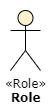
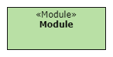
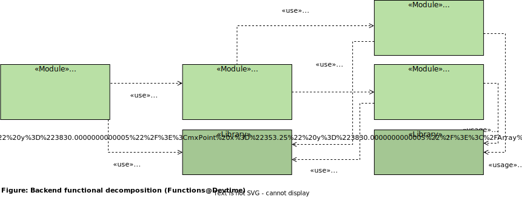

## Experiment für ADF-Methode mit PlantUML und Diagrams
### 0. Installtion für PlantUML
Auf dieser Seite finden Sie Anleitungen zur Installation: https://plantuml.com/de/starting

### 1. Anleitung für PlantUML
PlantUML ist ein textbasiertes Werkzeug, das die Erstellung von Diagrammen
mittels einer einfachen, menschlich verständlichen Textbeschreibung ermöglicht.
Die Struktur der Diagramme ist dadurch leicht verständlich und editierbar.

Betrachten Sie das folgendes Diagram:


Code:
```
@startuml solution approach

!define Yellow #fff2cc
!define Green #b9e0a5
!define Pink #fff0e8
!define Red #f8cecc
!define Orange #ffe6cc
!define White #ffffff

component "**Meal Display**" <<Component>> as a Yellow
component "**Meal Data Acquisition**" <<Component>> as b Yellow

a .> b  :<<use>>\n get meal info
@enduml
```
Sie können gerne den Code kopieren und rumprobieren. <br>

1. An Anfang und Ende wird mit @startuml und @enduml definiert. <br>
2. 'solution approach' ist der Name des Diagramms. <br>
3. In '!define' sind Definitionen für Farbcode. <br>
4. '**' dienen dazu, Text fett zu markieren. <br>
5. In PlantUML kann durch Pfeile '-->', '-|>', '<..' leicht die Elemete positioniert werden. Es besteht eine automatische Positionierung in PlantUML<br>
6. ':<\<use>>\n get meal info' ist die Pfeilbeschreibung.<br>
7. 'as a' & 'as b' ist wie Variable, die man später 
8. Die Farbe können Sie hinter 'as a' schreiben.<br>


#### Hinweise: 
Wenn Sie die Farbe global definieren möchten, anstatt sie für jedes Element einzeln zu definieren, sollten Sie sich das Folgende ansehen: https://github.com/YanChunChang/BA_Plantuml/tree/main/Color-Element
Unter die beiden Dateien: Software@Runtime und Software@Devtime.
Dies ist aber nicht erforderlich für die Tests.

### 2. List der Elemente für ADF-Diagramme in PlantUML
### Software@Runtime
| Element     | Code        | Anmerkung    |
| ----------- | ----------- | ------------ |
|      | 1. ```:<<Role>>\nRole: Yellow``` <br>2. ```:Role: Yellow``` | 1. '\n' dient dazu, dass es so wie im Bild aussieht. Ansonsten kann man auch '<\<Role>>\n' weglassen.<br> 2. 'Role' wird ohne '<\<Role>>' abgebildet.|
|   | ```node "**System**" <<System>> as s Yellow```| '**' wird verwendet für Bold. |
|   | ```node "**External System**" <<External System>> as es Yellow```| '**' wird verwendet für Bold. |
|   | ```Component "**Component**" <<Component>> as c Yellow```   | '**' wird verwendet für Bold. |
|   | 1. ```-0)-```<br> 2. ```-(0-``` | Für die Pfeilbeschriftung: '-0)- :use' |
|   | ```rectangle "**Technology**" <<Technology>> as t Red``` | '**' wird verwendet für Bold. |
|   | ```Element1 ..> Element2  :<<dataflow>>```        |Für Pfeilbeschriftung: ':<\<dataflow>> dataflow'|
|   | ```Element1 ..> Element2  :<<use>>``` | Für Pfeilbeschriftung: ':<\<use>> use'  |
|   | ```-```      | "-" kann verlängert werden(z.B. --). Die Linie sieht auch länger aus.|

### Software@Devtime
| Element     | Code        | Anmerkung   |
| ----------- | ----------- | ----------- |
|   |  ```rectangle "**Module**" <<Module>> as m Green``` |'**' wird verwendet für Bold. |
|   | ```rectangle "**Interface**" <<Interface>> as i Green``` | '**' wird verwendet für Bold.  |
|   | ```package "<<Package>> \n**Package**" Green{ 'Elemente hinzufügen }```  | Wenn 'as xxx' geschrieben wird, muss unbedingt ein Element in {} eingefügt werden, da sonst die Überschrift nicht mehr korrekt positioniert ist. |
|   | ```rectangle "**Library**" <<Library>> as l Green``` |'**' wird verwendet für Bold. |
|   | ```rectangle "**Technology**" <<Technology>> as t Red``` | '**' wird verwendet für Bold. |
|   | ```Element1 .> Element2  :<<use>>```| Nach '<\<use>>' kann die Beschreibung noch hinzugefügt werden.  |
|   | Asscociation : ```-``` <br> Generalization: ```-\|>```<br> Realization: ```..\|>```<br> Composition: ```*--``` <br> Aggregation: ```o--```| - |
|   | ```-``` | "-" kann verlängert werden(z.B. --). Die Linie sieht auch länger aus. |

### 3. Experiment
Für das folgende Experiment ist es nicht notwendig, die Größe des Elements und die Schriftart sowie die Farbeabweichung zu berücksichtigen, und es ist auch nicht wichtig, ob die Pfeile gekrümmt sind oder nicht.

Für die Erstellung der Diagramme siehe Abschnitt 2 der Listen Software@Runtime und Software@Devtime für die notwendigen Elemente zur Erstellung der Diagramme. Sie können den Code einfach kopieren und direkt verwenden. Bitte vergessen Sie nicht, den Farbcode am Anfang der Datei hinzuzufügen.
#### Diagramm(unter 10 Elemente)
1. Test A: <br> Bitte erstellen Sie die folgenden 3 Diagramme mit PlantUML, ohne dabei die Positionierung zu berücksichtigen. 


| Nr.         | Code        | 
| ----------- | ----------- | 
|1||
|2||
|3||

1. Test B: Versuchen Sie nun, die Position der 3 Diagramme anzupassen. Für die Positionierung in PlantUML siehe die Datei 'explanatin-Position-in-PlantUML' unter der Adressen: https://github.com/YanChunChang/BA_Plantuml/tree/main/PlantUML-Position. 

#### Diagramm(über 10 Elemente)
1. Test C: Bitte versuchen Sie, das folgende Diagramm mit PlantUML zu erstellen. Probieren Sie erstmal ohne die Positionierung zu beachten. 

2. Test D: Versuchen Sie nun, die Elemente des Diagramms sinnvoll zu positionieren. Sie können auch versuchen, die Elemente wie im Beispiel zu positionieren. Wenn Sie der Meinung sind, dass das Diagramm bereits sinnvoll positioniert ist, brauchen Sie nicht weiterzumachen.

**Überlegen Sie kurz wie gut/schnell das Diagramm in Test C erstellt wurde.


### 4. ADF-Methode
ADF steht für Architecture Decomposition Framework (ADF). Das ist ein Framework für Architekturdesign.
Um die weitere Experiment weiterzumachen, lesen Sie bitte die kurze Erklärung über System-Kontext-Diagramm (System-context delineation) unter diesen Link: https://github.com/architecture-decomposition-framework/welcome-to-adf/blob/main/adf-design/Design.md

Ein Beispiel finden Sie unter diesen Link: https://github.com/neshanjo/what2eat/blob/with-cache/doc/architecture-documentation.md What2Eat ist eine einfache Anwendung, die das Tagesmenü der Mensa anzeigt. Darüber hinaus bietet das System eine besondere Funktion: Cafeteria-Menü mit Cold-Bowl-Wahrscheinlichkeit. Wenn es zu kalt ist, bietet die Mensa kein Cold Bowl an. Dazu werden Wetterdaten von einem externen Dienst benötigt. Schauen Sie sich das Beispiel in Kapitel 2.1 an, um später das System-Kontext-Diagramm zu erstellen.

### 5. Systembeschreibung - StickyBackUp
Bitte lesen Sie den folgenden Text und skizzieren Sie zunächst Ihr grobes Diagramm auf einem Blatt Papier. Erstellen Sie nun ein System-Kontext-Diagramm mit Hilfe von PlantUML und Diagrams.net. Die beiden Diagramme müssen nicht gleich aussehen, wichtig ist, dass der Inhalt korrekt und lesbar ist.
Diagrams.net für ADF-Methode: https://app.diagrams.net/?src=about

SecuLabs betreibt Forschung an neuen Pharmaprodukten. Die Mitarbeitenden in den Laboren benutzen PCs ohne Internetverbindung, auf denen die Messgeräte die Versuchsdaten des aktuellen Tages speichern.

Aufgrund von Sicherheitsgründen werden die PCs jeden Abend auf den Ursprungszustand zurückgesetzt. Das bedeutet, dass alle Daten gelöscht, alle Programme neu installiert und alle Einstellungen zurückgesetzt werden. Jeder Mitarbeiter erhält einen personalisierten USB-Stick, auf dem die Daten des aktuellen Tages am Abend gesichert werden. Die persönliche ID ist auf dem USB-Stick unveränderbar gespeichert.

Bisher wurde der Inhalt der Sticks jeden Tag manuell gesichert, was zu aufwändig ist. Daher soll ein neues System namens StickyBackup entwickelt werden. Es handelt sich um einen PC in einem Spezialgehäuse, das nur einen USB-Port nach außen hin anbietet und intern an das Firmennetzwerk angebunden ist. Die Mitarbeitenden stecken vor dem Verlassen der Firma ihren USB-Stick in den Port.

StickyBackup fragt beim ID-Server von SecuLabs anhand der ID des Sticks an, um welchen Mitarbeiter und welche Abteilung es sich handelt. Anschließend kopiert StickyBackup die Daten des Sticks in ein Verzeichnis auf dem Firmen-Backup-Server und löscht sie (unwiederherstellbar) vom Stick. Nachdem die Daten erfolgreich kopiert wurden, erhält das Gebäudesteuerungssystem die Anweisung, die Ausgangstür zu öffnen.

#### Hinweise:
System: StickyBackup. <br>
External Systeme sind alle anderen Systeme, die mit dem System verbunden sind. <br>

