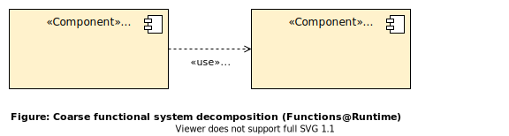
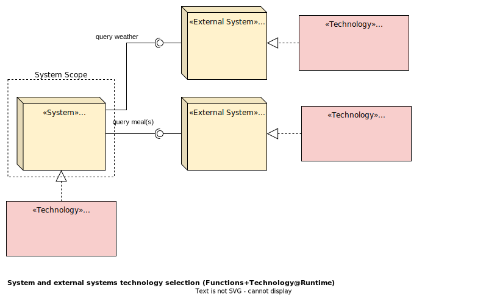

## Vergleich mit diagram.net und plantuml im Beispiel what2eat

|Nr.          | Diagram.net     | Plantuml        | Anmerkung    |
| ----------- | ----------- | ----------- | ------------ |
|1|||Es lässt sich gut darstellen.|
|2||| Es lässt sich gut darstellen.|
|3|||Das Zentrieren von Wörtern ist nicht einfach.|
|4|||Die Form der Notiz wird automatisch von Plantuml gesteuert. Sie kann nicht vom Benutzer bestimmt werden. Je nach Situation sieht die Notiz wie dragram.net aus.|
|5|||Es lässt sich gut darstellen.|
|6|||Es lässt sich gut darstellen.|
|7|||Plantuml ist besser strukturiert. Die Hierarchie ist klarer als bei Diagram.net. Es ist deutlicher, dass MensaKIService und WeatherBitService Jackson und Okhttp verwenden.|
|8|||Pfeile, die ins Leere zeigen, können nicht dargestellt werden.|
|9|||Pfeile, die ins Leere zeigen, können nicht dargestellt werden. Außerdem kann die Position der Beschreibung des "Usage"-Pfeils nicht geändert werden. Die einzige Möglichkeit, zu verhindern, dass die Beschreibung die Diagramme überlappt, besteht darin, eine längere Linie zu verwenden.|
|10|||Es lässt sich gut darstellen.|
|11|||Es lässt sich gut darstellen.|
|12||")|Es lässt sich gut darstellen.|
|13||")|Es lässt sich gut darstellen.|